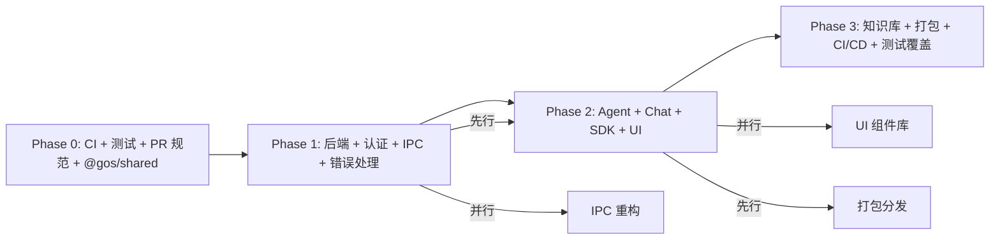

# Growth OS 架构审查与技术选型方案

> 审查日期：2026-07-31
> 审查范围：完整代码仓库
> 审查角色：产品经理 + 架构师

---

## 目录

1. [项目概况](#1-项目概况)
2. [现状评估](#2-现状评估)
3. [代码质量逐项审查](#3-代码质量逐项审查)
4. [问题清单与优先级](#4-问题清单与优先级)
5. [总体架构蓝图](#5-总体架构蓝图)
6. [分层架构详细设计](#6-分层架构详细设计)
7. [架构优化方案](#7-架构优化方案)
8. [一期技术选型方案](#8-一期技术选型方案)
9. [一期实施路线图](#9-一期实施路线图)
10. [风险与缓解策略](#10-风险与缓解策略)
11. [附录 A — 文件清单](#11-附录-a--文件清单)
12. [附录 B — 相关命令速查](#12-附录-b--相关命令速查)

---

## 1. 项目概况

### 1.1 基本信息

| 项目              | 内容                                |
| ----------------- | ----------------------------------- |
| **项目名称**      | Growth OS                           |
| **产品定位**      | 仿 Coze 桌面应用（AI Agent 平台）   |
| **仓库类型**      | Turborepo + pnpm workspace Monorepo |
| **Node 版本要求** | >= 24.0.0（见 `.nvmrc`）            |
| **包管理器**      | pnpm 11.17.0                        |
| **当前代码量**    | ~500 行源码（极早期阶段）           |

### 1.2 现有目录结构

```
Growth OS/
├── apps/
│   └── desktop/                    # Nuxt 4 桌面应用
│       ├── app/
│       │   ├── app.vue             # 应用根组件（3 行占位）
│       │   └── assets/css/main.css # Tailwind 入口 + daisyUI
│       ├── modules/
│       │   └── electron.ts         # Nuxt module: vite-plugin-electron
│       ├── nuxt.config.ts          # Nuxt 配置
│       ├── package.json
│       ├── tsconfig.json           # 引用 .nuxt 生成的配置
│       └── .oxlintrc.json          # Vue + TailwindCSS 检查规则
│
├── packages/
│   └── desktop-core/               # Electron 主进程 + preload
│       ├── src/
│       │   ├── main.ts             # Electron main 进程（窗口创建、IPC 入口）
│       │   ├── preload.ts          # contextBridge 安全桥接
│       │   └── types.ts            # DesktopAPI 类型定义
│       ├── electron-builder.yml    # 打包配置
│       ├── package.json
│       ├── tsconfig.json           # 继承 runtime/node.json
│       └── .oxlintrc.json          # Node.js 环境规则
│
├── tooling/
│   ├── typescript/                 # 分层 tsconfig 配置
│   │   ├── base.json               # 语言规则层（strict, noUncheckedIndexedAccess...）
│   │   ├── runtime/
│   │   │   ├── browser.json        # DOM + ES2024
│   │   │   └── node.json           # NodeNext + @types/node
│   │   └── framework/
│   │       ├── vue.json            # browser + vue JSX
│   │       ├── nuxt.json           # vue + nuxt types
│   │       ├── react.json          # browser + react-jsx
│   │       ├── next.json           # react（空壳）
│   │       ├── nest.json           # node + decorator metadata
│   │       ├── tauri.json          # browser（空壳）
│   │       ├── library.json        # base + declaration/composite
│   │       └── test.json           # base + vitest/globals
│   ├── lint/
│   │   └── .oxlintrc.json          # 通用 lint 规则
│   └── format/
│       └── .oxfmtrc.json           # 通用 format 规则
│
├── docs/
│   └── architecture/
│       └── typescript-config.md    # TypeScript 配置设计说明
│
├── .github/
│   ├── workflows/ci.yml            # 空文件（未实现）
│   ├── CODEOWNERS                  # 空文件
│   ├── dependabot.yml              # 空文件
│   └── PULL_REQUEST_TEMPLATE.md    # 空文件
│
├── .trae/                          # IDE 配置
│   ├── rules/git-commit-message.md # Commit 规范
│   ├── mcp.json                    # MCP 服务配置
│   └── skills/                     # 技术栈技能文件
│
├── package.json                    # 根 package
├── pnpm-workspace.yaml             # Workspace 配置
├── turbo.json                      # Turborepo 任务编排
├── .editorconfig                   # 编辑器配置
├── .gitignore
├── .npmrc
├── .nvmrc
└── .env.example                    # 环境变量示例
```

### 1.3 当前技术栈

| 组件      | 技术                | 版本    | 状态      |
| --------- | ------------------- | ------- | --------- |
| 桌面壳    | Electron            | 43.2.0  | ✅ 已集成 |
| 前端框架  | Nuxt                | 4.5.1   | ✅ 已集成 |
| UI 框架   | Vue                 | 3.5.40  | ✅ 已集成 |
| CSS 框架  | TailwindCSS         | 4.3.3   | ✅ 已集成 |
| UI 组件库 | daisyUI             | 5.7.4   | ✅ 已集成 |
| 类型语言  | TypeScript          | 6.0.3   | ✅ 已锁定 |
| Linter    | oxlint              | 1.76.0  | ✅ 已集成 |
| Formatter | oxfmt               | 0.61.0  | ✅ 已集成 |
| 构建编排  | Turborepo           | 2.10.7  | ✅ 已集成 |
| 包管理    | pnpm                | 11.17.0 | ✅ 已锁定 |
| 桌面打包  | electron-builder    | 26.15.3 | ✅ 已配置 |
| 后端框架  | NestJS              | 未引入  | ❌ 待实施 |
| 数据库    | Supabase/PostgreSQL | 未引入  | ❌ 待实施 |
| 测试框架  | 无                  | —       | ❌ 待实施 |
| CI/CD     | GitHub Actions      | 未实现  | ❌ 待实施 |
| ORM       | MikroORM            | 未引入  | ❌ 待实施 |
| 状态管理  | Pinia               | 未引入  | ❌ 待实施 |

---

## 2. 现状评估

### 2.1 已确认的优势

#### 2.1.1 Monorepo 基础设施扎实

- **域划分清晰**：`pnpm-workspace.yaml` 将代码分为 `apps/*`（应用）、`packages/*`（库）、`tooling/*`（工具配置）、`docs/*`（文档），互不干扰
- **依赖版本统一**：通过 pnpm Catalogs 机制管理 `dev`/`lint`/`format`/`frontend` 四类依赖版本
- **构建拓扑感知**：`turbo.json` 中 `build.dependsOn: ["^build"]` 确保按依赖顺序构建

Catalogs 配置（来自 `pnpm-workspace.yaml`）：

```yaml
catalogs:
  dev:
    "@types/node": ^26.1.1
    turbo: ^2.10.7
    typescript: 6.0.3
  lint:
    oxlint: ^1.76.0
  format:
    oxfmt: ^0.61.0
  frontend:
    electron: ^43.2.0
    nuxt: ^4.5.1
    vue: ^3.5.40
    vue-router: ^5.2.0
    tailwindcss: ^4.3.3
    daisyui: ^5.7.4
```

#### 2.1.2 TypeScript 配置设计优秀

采用 **Language → Runtime → Preset → Project** 四层继承体系：

```text
                    base
                 /        \
          browser         node
             │              │
      ┌──────┴──────┐       │
      │             │       │
     vue         react     nest   ← Preset 层
      │             │
     nuxt         next
```

分层原则：

- **base.json** — 只定义 TypeScript 语言规则（strict、noUncheckedIndexedAccess、verbatimModuleSyntax），不知道任何框架或运行时
- **runtime/browser.json** — 浏览器运行时（DOM、ES2024、Bundler 模块解析）
- **runtime/node.json** — Node 运行时（NodeNext、@types/node）
- **framework/vue.json** — 继承 browser，增加 vue JSX
- **framework/nest.json** — 继承 node，增加 decorator metadata
- **framework/library.json** — 独立体系，继承 base，增加 declaration/composite/incremental

当前已有 presets 覆盖场景：

- `vue.json` / `nuxt.json` — 桌面前端
- `react.json` / `next.json` — 预留 Web 端
- `nest.json` — 预留后端
- `tauri.json` — 预留 Tauri 迁移选项
- `library.json` — 包开发
- `test.json` — 测试环境

#### 2.1.3 Electron 安全体系正确

```typescript
// main.ts
const win = new BrowserWindow({
  webPreferences: {
    contextIsolation: true, // 渲染进程与预加载脚本上下文隔离
    nodeIntegration: false, // 禁止渲染进程直接访问 Node.js API
    preload: preloadPath, // 仅通过 preload 桥接
  },
});

// preload.ts — 最小暴露原则
contextBridge.exposeInMainWorld("desktop", {
  version: () => ipcRenderer.invoke("get-version"),
});
```

优点：

- `contextIsolation: true` 防止渲染进程直接访问 Electron API
- `nodeIntegration: false` 防止 `require()` 注入
- preload 只暴露一个 `version()` 方法——最小暴露原则

#### 2.1.4 Electron + Nuxt 集成良好

`apps/desktop/modules/electron.ts` Nuxt Module 实现：

```typescript
// 开发模式：Nuxt 启动后自动编译 main/preload 并启动 Electron 窗口
nuxt.hook("listen", async (_server, listener) => {
  // 使用 vite-plugin-electron 编译 main.ts / preload.ts
  // 使用 startup() 启动 Electron 进程
});

// 生产模式：Nuxt 构建后编译 Electron 入口
nuxt.hook("build:done", async () => {
  // 仅编译，不启动（由 electron-builder 打包）
});
```

#### 2.1.5 工具链现代化

- **oxlint 代替 ESLint** — 性能提升 50-100x，原生支持 TypeScript/Vue/Import/Unicorn 插件
- **oxfmt 代替 Prettier** — Rust 实现，格式化速度极快
- 子项目可覆盖配置（desktop-core 的 `no-console: off`，apps/desktop 的 `no-console: off` 各有合理理由）

#### 2.1.6 开发者体验

- Nuxt DevTools 已启用
- `vite-plugin-electron` 支持 main/preload 热重载
- `.editorconfig` 统一编辑器行为
- `.nvmrc` 统一 Node 版本

### 2.2 识别的问题与风险

#### P0 - 严重阻塞（必须立即修复）

| #   | 问题                  | 影响                                             | 当前状态                          | 修复成本 |
| --- | --------------------- | ------------------------------------------------ | --------------------------------- | -------- |
| 1   | **CI 流水线为空**     | 代码合入无质量门禁，退化不可感知                 | `.github/workflows/ci.yml` 空文件 | 低       |
| 2   | **无测试框架**        | 核心逻辑（LLM 调用、Agent 编排）上线前无验证手段 | 无 `vitest.config`/`jest.config`  | 低       |
| 3   | **PR 协作三件套为空** | 无代码审查模板、无自动依赖更新、无 CODEOWNERS    | 三个文件皆空                      | 低       |

#### P1 - 短期阻塞（1-2 周内需要解决）

| #   | 问题                   | 影响                                                                           | 涉及文件                               | 修复成本   |
| --- | ---------------------- | ------------------------------------------------------------------------------ | -------------------------------------- | ---------- |
| 4   | **后端完全缺失**       | `.env.example` 声明了 Supabase + OpenAI，但无可运行的后端服务                  | 无 `apps/server`                       | 高（新建） |
| 5   | **IPC 类型不一致风险** | `types.ts` 定义的 `DesktopAPI` 与 `main.ts` 中的 `ipcMain.handle` 无编译期关联 | `packages/desktop-core/src/types.ts`   | 低         |
| 6   | **无全局错误处理**     | Electron 崩溃 / LLM 请求失败 / 渲染进程异常时用户无感知                        | `main.ts` 缺 `unhandledrejection` 监听 | 低         |
| 7   | **无运行时环境校验**   | 启动时缺少 Supabase URL/Key 等关键环境变量不报错                               | `nuxt.config.ts` 无 env 校验           | 低         |

#### P2 - 中期改进（1 个月内）

| #   | 问题                                     | 说明                                                                                         |
| --- | ---------------------------------------- | -------------------------------------------------------------------------------------------- |
| 8   | oxlint 配置不一致                        | 根 `lint/.oxlintrc.json` 的 `no-console: warn` 与 desktop-core 的 `no-console: off` 逻辑冲突 |
| 9   | Turborepo 任务不完整                     | `turbo.json` 缺少 `test`、`typecheck` 任务的依赖与缓存策略                                   |
| 10  | 无 lint-staged 门禁                      | 提交前没有自动格式化和 lint 检查                                                             |
| 11  | 无日志体系                               | 仅 `console.log`/`console.error`，无可查询性                                                 |
| 12  | 无状态管理                               | 未引入 Pinia，app 级别状态无约定                                                             |
| 13  | 无 Docker 化                             | 后端部署路径未定义                                                                           |
| 14  | Commit 规范未强制执行                    | `.trae/rules/git-commit-message.md` 仅停留在文档层面                                         |
| 15  | `.env.example` 不完整                    | 缺少桌面端配置项（如自动更新 URL）                                                           |
| 16  | `turbo.json` 中 `dev` 任务缺 `dependsOn` | 可能导致多 app 模式下的启动顺序问题                                                          |

#### P3 - 远期关注

| #   | 问题            | 说明                                       |
| --- | --------------- | ------------------------------------------ |
| 17  | 无自动更新      | electron-builder 配置中无 electron-updater |
| 18  | 无代码签名      | 桌面端分发前需配置签名证书                 |
| 19  | 无性能基准      | 未建立 FPS/内存/启动时间的监控             |
| 20  | 无 API 版本策略 | 后端 API 尚未设计版本化方案                |
| 21  | 无国际化(i18n)  | 产品定位可能面向全球用户                   |

---

## 3. 代码质量逐项审查

### 3.1 文件级评分

| 文件路径                                     | 评分 | 行数      | 问题                                                                    | 建议                                                 |
| -------------------------------------------- | ---- | --------- | ----------------------------------------------------------------------- | ---------------------------------------------------- |
| `apps/desktop/nuxt.config.ts`                | B+   | 29        | 无环境变量驱动的配置差异（dev/prod）                                    | 添加 `runtimeConfig` 或 `appConfig` 动态配置         |
| `apps/desktop/modules/electron.ts`           | A-   | 77        | `_server: unknown` 后强制 cast 为 `any`；错误只 console.error 不处理    | 使用 `NitroDevServer` 类型；添加 Nuxt 层面的错误通知 |
| `apps/desktop/app/app.vue`                   | C    | 3         | 仅有占位文本                                                            | 需尽快填充页面结构                                   |
| `apps/desktop/app/assets/css/main.css`       | A-   | 2         | 正确使用 TailwindCSS 4 + daisyUI 5 语法                                 | 无                                                   |
| `apps/desktop/tsconfig.json`                 | A    | 5         | 正确引用 Nuxt 生成的 tsconfig                                           | 无                                                   |
| `apps/desktop/.oxlintrc.json`                | A-   | 74        | 配置全面，但部分规则（enforce-sort-order）在早期可能过于严格            | 早期可设为 warn                                      |
| `packages/desktop-core/src/main.ts`          | A-   | 63        | 代码简洁，缺少窗口恢复策略（macOS 点击 Dock 图标不重建窗口）            | 添加 `app.on('activate')` 监听                       |
| `packages/desktop-core/src/preload.ts`       | A    | 8         | 最小暴露原则执行良好                                                    | 无                                                   |
| `packages/desktop-core/src/types.ts`         | A-   | 14        | 接口清晰，但 IPC 类型未与 main 共享                                     | 提取到共享包                                         |
| `packages/desktop-core/electron-builder.yml` | B+   | 26        | 配置正确，但缺少 Win 签名、macOS 公证、自动更新                         | 后续补充                                             |
| `packages/desktop-core/tsconfig.json`        | A    | 7         | 正确继承 runtime/node.json                                              | 无                                                   |
| `tooling/typescript/base.json`               | A    | 21        | strict + noUncheckedIndexedAccess + verbatimModuleSyntax 等标准严格配置 | 无                                                   |
| `tooling/typescript/runtime/browser.json`    | A    | 15        | 正确区分 browser/node 运行时                                            | 无                                                   |
| `tooling/typescript/runtime/node.json`       | A    | 15        | 使用 NodeNext 模块解析                                                  | 无                                                   |
| `tooling/typescript/framework/*.json`        | A-   | 各 3-8 行 | 职责单一，但 nest.json 未继承 base 而是 node                            | 已验证继承正确                                       |
| `tooling/lint/.oxlintrc.json`                | B+   | 27        | 配置合理，但 `no-console: warn` 与子项目 `off` 不一致                   | 统一策略                                             |
| `tooling/format/.oxfmtrc.json`               | A    | 27        | 配置完整，忽略模式合理                                                  | 无                                                   |
| `turbo.json`                                 | B+   | 21        | 简洁但缺少 test/typecheck 任务                                          | 迭代补充                                             |
| `pnpm-workspace.yaml`                        | A    | 17        | Catalogs 分组合理                                                       | 无                                                   |
| `.editorconfig`                              | A    | 16        | 配置完整                                                                | 无                                                   |
| `.gitignore`                                 | A    | 21        | 覆盖 Nuxt/Electron/pnpm 产物                                            | 无                                                   |
| `.env.example`                               | B    | 11        | 缺少桌面端特有的环境变量                                                | 补充 `DESKTOP_AUTO_UPDATE_URL`、`LOG_LEVEL` 等       |

### 3.2 代码片段审查

#### 3.2.1 `apps/desktop/modules/electron.ts`（第 33 行）

```typescript
nuxt.hook('listen', async (_server: unknown, listener: { url: string }) => {
  // ...
  const url = listener.url ?? `http://localhost:${(_server as any)?.address()?.port ?? 3000}`;
```

问题：`_server` 类型为 `unknown` 后强制 `as any`，丢失类型安全。Nuxt 4 的 `listen` hook 参数类型是 `NitroDevServer`。

建议：使用 `import type { NitroDevServer } from 'nitro/types'` 或 `Nitro` 类型定义。

#### 3.2.2 `packages/desktop-core/src/main.ts`（第 59 行）

```typescript
app.on("window-all-closed", () => {
  if (process.platform !== "darwin") {
    app.quit();
  }
});
```

问题：缺少 `app.on('activate')` 监听器。在 macOS 上，关闭所有窗口后应用应保留，用户点击 Dock 图标时重新创建窗口。

#### 3.2.3 `apps/desktop/app/app.vue`

```vue
<template>
  你好, Growth OS 桌面端!
  <button class="btn btn-secondary">打开文件</button>
</template>
```

问题：占位代码，无 `<script setup>`、无 `<style scoped>`、无实际逻辑。

---

## 4. 问题清单与优先级

按 **严重程度 × 影响范围 × 修复成本** 三维度排序：

```
严重程度：🔴 阻塞  🟡 高  🟢 中  ⚪ 低
```

| 优先级 | ID   | 问题                   | 严重程度 | 影响范围     | 修复成本 | 期望完成 |
| ------ | ---- | ---------------------- | -------- | ------------ | -------- | -------- |
| P0     | C-01 | CI 流水线为空          | 🔴       | 全项目       | 1h       | ASAP     |
| P0     | C-02 | 无测试框架             | 🔴       | 全项目       | 2h       | ASAP     |
| P0     | C-03 | PR 协作三件套为空      | 🔴       | 全项目       | 30min    | ASAP     |
| P1     | C-04 | 后端完全缺失           | 🟡       | 全产品       | 新建项目 | Week 1-2 |
| P1     | C-05 | IPC 类型不一致         | 🟡       | desktop-core | 1h       | Week 1   |
| P1     | C-06 | 无全局错误处理         | 🟡       | 全产品       | 2h       | Week 1   |
| P1     | C-07 | 无运行时环境校验       | 🟡       | 全产品       | 1h       | Week 1   |
| P2     | C-08 | oxlint 配置不一致      | 🟢       | tooling      | 30min    | Week 2   |
| P2     | C-09 | turbo.json 任务不完整  | 🟢       | 构建         | 1h       | Week 2   |
| P2     | C-10 | 无 lint-staged 门禁    | 🟢       | 全项目       | 1h       | Week 2   |
| P2     | C-11 | 无日志体系             | 🟢       | 全产品       | 2h       | Week 2   |
| P2     | C-12 | 无状态管理             | 🟢       | 前端         | 2h       | Week 2   |
| P2     | C-13 | 无 Docker 化           | 🟢       | 后端         | 3h       | Week 2-3 |
| P2     | C-14 | Commit 规范未强制执行  | 🟢       | 全项目       | 1h       | Week 2   |
| P2     | C-15 | .env.example 不完整    | ⚪       | 配置         | 30min    | Week 2   |
| P2     | C-16 | turbo dev 缺 dependsOn | ⚪       | 构建         | 15min    | Week 2   |
| P3     | C-17 | 无自动更新             | 🟡       | 桌面端       | 后续     | Month 2  |
| P3     | C-18 | 无代码签名             | 🟡       | 桌面端       | 后续     | Month 2  |
| P3     | C-19 | 无性能基准             | 🟢       | 全产品       | 后续     | Month 2  |
| P3     | C-20 | 无 API 版本策略        | 🟢       | 后端         | 后续     | Month 2  |
| P3     | C-21 | 无国际化               | ⚪       | 前端         | 后续     | 按需     |

---

## 5. 总体架构蓝图

### 5.1 架构总览

```
┌─────────────────────────────────────────────────────────────────────────┐
│                        Growth OS 架构蓝图                                 │
├─────────────────────────────────────────────────────────────────────────┤
│                                                                         │
│  ┌────────────────────────────────────────────────────────────────────┐ │
│  │                      Presentation Layer                              │ │
│  │                                                                      │ │
│  │  ┌──────────────────────────────────────────────────────────────┐  │ │
│  │  │              apps/desktop (Electron + Nuxt 4)                  │  │ │
│  │  │  ┌────────┐ ┌──────────┐ ┌─────────┐ ┌────────┐ ┌─────────┐ │  │ │
│  │  │  │Pages/  │ │ Layouts  │ │ Views   │ │Widgets │ │Composable│  │  │ │
│  │  │  │(路由)  │ │ (布局)   │ │ (页面)   │ │(组件)   │ │ (逻辑)   │  │  │ │
│  │  │  └────────┘ └──────────┘ └─────────┘ └────────┘ └─────────┘ │  │ │
│  │  └──────────────────────────────────────────────────────────────┘  │ │
│  └──────────────────────────┬───────────────────────────────────────────┘ │
│                             │                                             │
│  ┌──────────────────────────┴───────────────────────────────────────────┐ │
│  │                   Bridge Layer（桌面特有）                               │ │
│  │                                                                      │ │
│  │  ┌──────────────────────────────────────────────────────────────┐   │ │
│  │  │  packages/desktop-core — Electron main process                  │   │ │
│  │  │  ┌─────────┐ ┌──────────┐ ┌──────────┐ ┌──────────┐ ┌──────┐ │   │ │
│  │  │  │Window   │ │ IPC      │ │ Auto     │ │ File     │ │Power │ │   │ │
│  │  │  │Manager  │ │Handlers  │ │ Updater  │ │ System   │ │Mon.  │ │   │ │
│  │  │  └─────────┘ └──────────┘ └──────────┘ └──────────┘ └──────┘ │   │ │
│  │  └──────────────────────────────────────────────────────────────┘   │ │
│  └──────────────────────────┬───────────────────────────────────────────┘ │
│                             │                                             │
│  ┌──────────────────────────┴───────────────────────────────────────────┐ │
│  │                   API Layer（一期新建）                                   │
│  │                                                                      │ │
│  │  ┌──────────────────────────────────────────────────────────────┐   │ │
│  │  │                  apps/server (NestJS)                           │   │ │
│  │  │  ┌──────────┐ ┌──────────┐ ┌──────────┐ ┌────────────────┐  │   │ │
│  │  │  │ Auth     │ │ Agent    │ │ Chat     │ │ Knowledge Base │  │   │ │
│  │  │  │ Module   │ │ Module   │ │ Module   │ │ Module         │  │   │ │
│  │  │  └──────────┘ └──────────┘ └──────────┘ └────────────────┘  │   │ │
│  │  │                                                              │   │ │
│  │  │  ┌──────────────────────────────────────────────────────┐    │   │ │
│  │  │  │ Infrastructure (Guard, Filter, Interceptor, Pipe)    │    │   │ │
│  │  │  └──────────────────────────────────────────────────────┘    │   │ │
│  │  └──────────────────────────────────────────────────────────────┘   │ │
│  └──────────────────────────┬───────────────────────────────────────────┘ │
│                             │ HTTPS / WebSocket / SSE                      │
│  ┌──────────────────────────┴───────────────────────────────────────────┐ │
│  │                    Data & Service Layer                                │ │
│  │                                                                      │ │
│  │  ┌──────────────────────┐ ┌──────────────────────┐ ┌───────────────┐ │ │
│  │  │      Supabase         │ │      Redis             │ │     OpenAI    │ │ │
│  │  │  ┌────┐ ┌──────────┐ │ │  ┌────┐ ┌──────────┐ │ │  ┌─────────┐ │ │ │
│  │  │  │Auth│ │PostgreSQL │ │ │  │Bull│ │ Cache    │ │ │  │Chat     │ │ │ │
│  │  │  │    │ │+ pgvector │ │ │  │MQ  │ │ (Session)│ │ │  │Completion│ │ │ │
│  │  │  └────┘ └──────────┘ │ │  └────┘ └──────────┘ │ │  │+Stream  │ │ │ │
│  │  │  ┌────┐ ┌──────────┐ │ │  ┌────┐ ┌──────────┐ │ │  │+Embed   │ │ │ │
│  │  │  │RLS │ │Realtime  │ │ │  │Rate│ │ Queue    │ │ │  └─────────┘ │ │ │
│  │  │  │    │ │          │ │ │  │Lmt │ │          │ │ │              │ │ │
│  │  │  └────┘ └──────────┘ │ │  └────┘ └──────────┘ │ │              │ │ │
│  │  └──────────────────────┘ └──────────────────────┘ └───────────────┘ │ │
│  └─────────────────────────────────────────────────────────────────────────┘ │
│                                                                         │
│  ┌────────────────────────────────────────────────────────────────────┐ │
│  │                     Shared Packages Layer                            │ │
│  │                                                                     │ │
│  │  ┌──────────────┐ ┌────────────┐ ┌────────────┐ ┌───────────────┐ │ │
│  │  │  @gos/shared  │ │  @gos/sdk  │ │  @gos/ui   │ │   @gos/ai     │ │ │
│  │  │  类型/常量    │ │  API 客户端 │ │  Vue 组件  │ │  LLM 工具     │ │ │
│  │  └──────────────┘ └────────────┘ └────────────┘ └───────────────┘ │ │
│  └────────────────────────────────────────────────────────────────────┘ │
│                                                                         │
│  ┌────────────────────────────────────────────────────────────────────┐ │
│  │                    Infrastructure Layer                               │ │
│  │                                                                     │ │
│  │  ┌────────────┐ ┌──────────────┐ ┌──────────┐ ┌─────────────────┐ │ │
│  │  │  Docker    │ │  GitHub      │ │ Environment │   Monitoring   │ │ │
│  │  │  Compose   │ │  Actions CI  │ │ Validation│   (待定)         │ │ │
│  │  └────────────┘ └──────────────┘ └──────────┘ └─────────────────┘ │ │
│  └────────────────────────────────────────────────────────────────────┘ │
└─────────────────────────────────────────────────────────────────────────┘
```

### 5.2 依赖拓扑

```
@gos/shared      (底层——零依赖)
    ↑
@gos/sdk         (依赖 shared)
@gos/ai          (依赖 shared)
@gos/ui          (依赖 daisyUI)
    ↑
apps/desktop     (依赖 shared, sdk, ui, desktop-core)
apps/server      (依赖 shared, sdk, ai)
packages/desktop-core (独立——Electron 原生)
```

### 5.3 数据流架构

```
用户操作 → Vue Component
            → Composable (useChat / useAgent / useAuth)
                → @gos/sdk (API Client)
                    → HTTP/SSE → NestJS Server
                        → Controller → Service
                            └→ MikroORM → Supabase PostgreSQL
                            └→ OpenAI SDK → LLM API
                            └→ BullMQ → Redis (异步任务)
                → IPC (桌面能力)
                    → desktop-core IPC Handlers
                        → Electron API (File System / Native Dialog / Auto Updater)
```

---

## 6. 分层架构详细设计

### 6.1 表示层（Presentation Layer）

#### 6.1.1 目录结构规划（`apps/desktop/`）

```
apps/desktop/
├── app/
│   ├── app.vue                      # 根组件（已存在）
│   ├── error.vue                    # 全局错误页（新建）
│   ├── layouts/
│   │   └── default.vue              # 默认布局（新建）
│   ├── pages/
│   │   ├── index.vue                # 首页（新建）
│   │   ├── login.vue                # 登录页（新建）
│   │   ├── chat/
│   │   │   └── [id].vue             # 对话详情（新建）
│   │   └── agent/
│   │       ├── index.vue            # Agent 列表（新建）
│   │       ├── new.vue              # 创建 Agent（新建）
│   │       └── [id].vue             # Agent 配置（新建）
│   ├── components/
│   │   ├── chat/
│   │   │   ├── ChatBubble.vue       # 对话气泡（新建）
│   │   │   ├── ChatInput.vue        # 输入框（新建）
│   │   │   └── ChatSidebar.vue      # 对话列表侧栏（新建）
│   │   ├── agent/
│   │   │   ├── AgentCard.vue        # Agent 卡片（新建）
│   │   │   └── AgentConfig.vue      # Agent 配置表单（新建）
│   │   └── common/
│   │       ├── AppHeader.vue        # 顶栏（新建）
│   │       ├── AppSidebar.vue       # 侧栏（新建）
│   │       └── MarkdownRenderer.vue # Markdown 渲染（新建）
│   ├── composables/
│   │   ├── useChat.ts               # 对话逻辑（新建）
│   │   ├── useAgent.ts              # Agent 逻辑（新建）
│   │   ├── useAuth.ts               # 认证逻辑（新建）
│   │   ├── useDesktop.ts            # 桌面 API 封装（新建）
│   │   └── useStreaming.ts          # SSE 流式处理（新建）
│   ├── stores/                      # Pinia Store（新建）
│   │   ├── chat.ts                  # 对话状态（新建）
│   │   ├── agent.ts                 # Agent 状态（新建）
│   │   └── auth.ts                  # 认证状态（新建）
│   ├── plugins/
│   │   ├── env-validate.ts          # 环境变量校验（新建）
│   │   └── error-handler.ts         # 全局错误处理（新建）
│   └── assets/
│       ├── css/
│       │   └── main.css             # 已存在
│       └── images/
│
├── modules/
│   └── electron.ts                  # 已存在
│
├── nuxt.config.ts                   # 已存在
├── package.json
├── tsconfig.json
└── .oxlintrc.json
```

#### 6.1.2 状态管理模型

```
┌─────────────────────────────────────────┐
│              Pinia Store                  │
├─────────────────────────────────────────┤
│                                         │
│  useAuthStore          useChatStore      │
│  ┌────────────────┐   ┌──────────────┐  │
│  │ user: User     │   │ conversations │  │
│  │ session: Auth  │   │ activeChat   │  │
│  │ isLoggedIn     │   │ streaming    │  │
│  │ login()        │   │ sendMessage  │  │
│  │ logout()       │   │ loadHistory  │  │
│  └────────────────┘   └──────────────┘  │
│                                         │
│  useAgentStore         useUIStore       │
│  ┌────────────────┐   ┌──────────────┐  │
│  │ agents: Agent[] │   │ sidebarOpen │  │
│  │ activeAgent    │   │ theme       │  │
│  │ createAgent()  │   │ loading     │  │
│  │ updateAgent()  │   │ toast       │  │
│  └────────────────┘   └──────────────┘  │
└─────────────────────────────────────────┘
```

### 6.2 桥接层（Bridge Layer）

#### 6.2.1 IPC 类型安全设计

```typescript
// @gos/shared/src/ipc-channels.ts（共享类型）
export interface IpcChannelMap {
  "get-version": { args: []; result: string };
  "get-platform": { args: []; result: NodeJS.Platform };
  "open-file-dialog": {
    args: [{ filters?: FileFilter[] }];
    result: string[] | null;
  };
  "save-file": {
    args: [{ content: string; filename: string }];
    result: string;
  };
  // 后续扩展在此追加
}

export type IpcChannel = keyof IpcChannelMap;

// 辅助类型——确保 main 和 preload 类型一致
export type IpcHandler<C extends IpcChannel> = (
  ...args: IpcChannelMap[C]["args"]
) => IpcChannelMap[C]["result"] | Promise<IpcChannelMap[C]["result"]>;
```

```typescript
// packages/desktop-core/src/main.ts
import type { IpcChannelMap } from "@gos/shared";

ipcMain.handle("get-version", () => app.getVersion());
ipcMain.handle("get-platform", () => process.platform);
ipcMain.handle("open-file-dialog", async () => {
  const result = await dialog.showOpenDialog(win!, { properties: ["openFile"] });
  return result.filePaths.length > 0 ? result.filePaths : null;
});
```

```typescript
// packages/desktop-core/src/preload.ts
import type { IpcChannelMap } from "@gos/shared";

const desktopApi = {
  version: () => ipcRenderer.invoke("get-version"),
  getPlatform: () => ipcRenderer.invoke("get-platform"),
  openFileDialog: (options: { filters?: FileFilter[] }) =>
    ipcRenderer.invoke("open-file-dialog", options),
};

contextBridge.exposeInMainWorld("desktop", desktopApi);
```

#### 6.2.2 Electron Main 模块拆分

```
packages/desktop-core/src/
├── main.ts              # 入口：初始化各模块
├── preload.ts           # contextBridge（不变）
├── types.ts             # DesktopAPI（后续迁移到 @gos/shared）
├── services/
│   ├── window.service.ts     # 窗口管理（创建/关闭/恢复）
│   ├── ipc.service.ts        # IPC Handler 注册
│   ├── auto-update.service.ts# 自动更新（后续实现）
│   └── file.service.ts       # 文件系统操作
└── utils/
    ├── logger.ts        # electron-log 封装
    └── paths.ts         # 路径工具
```

### 6.3 API 服务层（API Layer）

#### 6.3.1 Backend 目录结构（新建 `apps/server`）

```
apps/server/
├── src/
│   ├── main.ts                          # 应用入口
│   ├── app.module.ts                    # 根模块
│   ├── config/
│   │   ├── config.module.ts
│   │   ├── config.service.ts            # 配置管理（环境变量）
│   │   └── validation.ts                # Zod schema 校验
│   ├── common/
│   │   ├── guards/
│   │   │   ├── auth.guard.ts            # 认证守卫
│   │   │   └── rate-limit.guard.ts      # 限流守卫
│   │   ├── filters/
│   │   │   └── http-exception.filter.ts # 全局异常过滤器
│   │   ├── interceptors/
│   │   │   ├── logging.interceptor.ts   # 日志拦截器
│   │   │   └── transform.interceptor.ts # 响应格式统一
│   │   ├── pipes/
│   │   │   └── validation.pipe.ts       # DTO 校验管道
│   │   ├── dto/
│   │   │   └── pagination.dto.ts        # 分页 DTO
│   │   └── constants/
│   │       └── error-codes.ts           # 业务错误码
│   ├── modules/
│   │   ├── auth/
│   │   │   ├── auth.module.ts
│   │   │   ├── auth.controller.ts
│   │   │   ├── auth.service.ts
│   │   │   └── strategies/
│   │   │       └── supabase.strategy.ts # Supabase Auth 集成
│   │   ├── agent/
│   │   │   ├── agent.module.ts
│   │   │   ├── agent.controller.ts
│   │   │   ├── agent.service.ts
│   │   │   └── entities/
│   │   │       └── agent.entity.ts      # MikroORM Entity
│   │   ├── chat/
│   │   │   ├── chat.module.ts
│   │   │   ├── chat.controller.ts
│   │   │   ├── chat.service.ts
│   │   │   ├── chat.gateway.ts          # WebSocket Gateway
│   │   │   └── entities/
│   │   │       ├── conversation.entity.ts
│   │   │       └── message.entity.ts
│   │   └── knowledge/
│   │       └── ...                      # 知识库模块（一期延后）
│   └── database/
│       ├── database.module.ts
│       └── migrations/                   # MikroORM 迁移
│
├── test/
│   ├── app.e2e-spec.ts                  # E2E 测试
│   └── jest-e2e.json
│
├── package.json
├── tsconfig.json                          # 继承 frameworks/nest.json
├── tsconfig.build.json
├── nest-cli.json
└── Dockerfile
```

#### 6.3.2 API 端点设计（V1）

| Method | Path                                      | 说明                 | Auth |
| ------ | ----------------------------------------- | -------------------- | ---- |
| POST   | `/api/v1/auth/supabase`                   | Supabase 登录        | No   |
| GET    | `/api/v1/auth/me`                         | 当前用户信息         | Yes  |
| POST   | `/api/v1/agents`                          | 创建 Agent           | Yes  |
| GET    | `/api/v1/agents`                          | Agent 列表           | Yes  |
| GET    | `/api/v1/agents/:id`                      | Agent 详情           | Yes  |
| PATCH  | `/api/v1/agents/:id`                      | 更新 Agent           | Yes  |
| DELETE | `/api/v1/agents/:id`                      | 删除 Agent           | Yes  |
| POST   | `/api/v1/chat/completions`                | LLM 对话（SSE 流式） | Yes  |
| GET    | `/api/v1/chat/conversations`              | 对话列表             | Yes  |
| POST   | `/api/v1/chat/conversations`              | 创建对话             | Yes  |
| GET    | `/api/v1/chat/conversations/:id`          | 对话详情             | Yes  |
| DELETE | `/api/v1/chat/conversations/:id`          | 删除对话             | Yes  |
| GET    | `/api/v1/chat/conversations/:id/messages` | 消息历史             | Yes  |
| GET    | `/api/v1/health`                          | 健康检查             | No   |

#### 6.3.3 统一响应格式

```typescript
// 成功响应
{
  "code": 0,
  "data": { ... },       // 实际数据
  "meta": {              // 仅列表接口
    "page": 1,
    "pageSize": 20,
    "total": 100
  }
}

// 错误响应
{
  "code": 40001,
  "message": "Agent not found",
  "details": { ... }     // 可选：详细错误信息
}

// 流式响应（SSE）
event: message
data: {"content": "你好", "isEnd": false}

event: message
data: {"content": "，有什么可以帮你的？", "isEnd": false}

event: done
data: {"finishReason": "stop", "usage": {"promptTokens": 10, "completionTokens": 20}}
```

### 6.4 共享包层（Shared Packages Layer）

#### 6.4.1 `@gos/shared` — 共享类型和常量

```
packages/shared/
├── src/
│   ├── index.ts
│   ├── types/
│   │   ├── agent.ts         # Agent 类型定义
│   │   ├── chat.ts          # 对话/消息类型
│   │   ├── user.ts          # 用户类型
│   │   └── api.ts           # API 请求/响应类型
│   ├── constants/
│   │   ├── agent.ts         # Agent 限值常量
│   │   └── error-codes.ts   # 业务错误码枚举
│   └── utils/
│       ├── ipc-channels.ts  # IPC 通道映射（桌面端使用）
│       └── validation.ts    # Zod Schemas（共享校验规则）
├── package.json
└── tsconfig.json             # 继承 frameworks/library.json
```

#### 6.4.2 `@gos/sdk` — API 客户端

```
packages/sdk/
├── src/
│   ├── index.ts
│   ├── client.ts            # HTTP 客户端（fetch 封装）
│   ├── auth.ts              # 认证相关 API
│   ├── agent.ts             # Agent 相关 API
│   ├── chat.ts              # 对话相关 API（含 SSE）
│   └── types.ts             # Re-export from @gos/shared
├── package.json
└── tsconfig.json             # 继承 frameworks/library.json
```

#### 6.4.3 `@gos/ui` — Vue 组件库

```
packages/ui/
├── src/
│   ├── index.ts             # 组件注册入口
│   ├── components/
│   │   ├── AgentCard.vue
│   │   ├── ChatBubble.vue
│   │   ├── ChatInput.vue
│   │   ├── MarkdownRenderer.vue
│   │   ├── LoadingSpinner.vue
│   │   └── EmptyState.vue
│   └── composables/
│       └── useTheme.ts
├── package.json
└── tsconfig.json             # 继承 frameworks/vue.json
```

#### 6.4.4 `@gos/ai` — LLM 工具（二期）

```
packages/ai/
├── src/
│   ├── index.ts
│   ├── llm/
│   │   ├── client.ts        # OpenAI SDK 封装
│   │   ├── streaming.ts     # 流式处理
│   │   └── tokenizer.ts     # Token 计数
│   ├── prompt/
│   │   └── templates.ts     # Prompt 模板
│   └── agent/
│       └── executor.ts      # Agent 执行器（二期迁至 LangGraph）
├── package.json
└── tsconfig.json             # 继承 frameworks/library.json
```

### 6.5 数据层（Data Layer）

#### 6.5.1 Supabase Schema 设计

```sql
-- users：用户表（由 Supabase Auth 自动管理，补充业务字段）
CREATE TABLE public.profiles (
  id          UUID PRIMARY KEY REFERENCES auth.users(id) ON DELETE CASCADE,
  nickname    TEXT,
  avatar_url  TEXT,
  created_at  TIMESTAMPTZ NOT NULL DEFAULT now(),
  updated_at  TIMESTAMPTZ NOT NULL DEFAULT now()
);
ALTER TABLE public.profiles ENABLE ROW LEVEL SECURITY;

-- agents：Agent 定义
CREATE TABLE public.agents (
  id            UUID PRIMARY KEY DEFAULT gen_random_uuid(),
  user_id       UUID NOT NULL REFERENCES public.profiles(id) ON DELETE CASCADE,
  name          TEXT NOT NULL,
  description   TEXT,
  system_prompt TEXT,
  model         TEXT NOT NULL DEFAULT 'gpt-4o',
  temperature   REAL NOT NULL DEFAULT 0.7,
  avatar_url    TEXT,
  is_public     BOOLEAN NOT NULL DEFAULT false,
  created_at    TIMESTAMPTZ NOT NULL DEFAULT now(),
  updated_at    TIMESTAMPTZ NOT NULL DEFAULT now()
);
ALTER TABLE public.agents ENABLE ROW LEVEL SECURITY;

-- conversations：对话
CREATE TABLE public.conversations (
  id         UUID PRIMARY KEY DEFAULT gen_random_uuid(),
  user_id    UUID NOT NULL REFERENCES public.profiles(id) ON DELETE CASCADE,
  agent_id   UUID REFERENCES public.agents(id) ON DELETE SET NULL,
  title      TEXT NOT NULL DEFAULT '新对话',
  created_at TIMESTAMPTZ NOT NULL DEFAULT now(),
  updated_at TIMESTAMPTZ NOT NULL DEFAULT now()
);
ALTER TABLE public.conversations ENABLE ROW LEVEL SECURITY;

-- messages：消息
CREATE TABLE public.messages (
  id              UUID PRIMARY KEY DEFAULT gen_random_uuid(),
  conversation_id UUID NOT NULL REFERENCES public.conversations(id) ON DELETE CASCADE,
  role            TEXT NOT NULL CHECK (role IN ('user', 'assistant', 'system', 'tool')),
  content         TEXT NOT NULL,
  tool_calls      JSONB,
  tool_results    JSONB,
  token_usage     JSONB, -- { prompt_tokens, completion_tokens, total_tokens }
  created_at      TIMESTAMPTZ NOT NULL DEFAULT now()
);
ALTER TABLE public.messages ENABLE ROW LEVEL SECURITY;

-- knowledge_bases：知识库（二期）
CREATE TABLE public.knowledge_bases (
  id         UUID PRIMARY KEY DEFAULT gen_random_uuid(),
  user_id    UUID NOT NULL REFERENCES public.profiles(id) ON DELETE CASCADE,
  name       TEXT NOT NULL,
  config     JSONB, -- chunk_size, overlap, embedding_model 等
  created_at TIMESTAMPTZ NOT NULL DEFAULT now()
);
ALTER TABLE public.knowledge_bases ENABLE ROW LEVEL SECURITY;

-- RLS Policies（示例）
CREATE POLICY "Users can only see their own agents"
  ON public.agents FOR ALL
  USING (auth.uid() = user_id);

CREATE POLICY "Anyone can see public agents"
  ON public.agents FOR SELECT
  USING (is_public = true OR auth.uid() = user_id);
```

#### 6.5.2 矢量存储

```sql
-- 迁移脚本（使用 MikroORM 或 pgvector 原生）
CREATE EXTENSION IF NOT EXISTS vector;

-- embeddings：知识库向量（二期）
CREATE TABLE public.embeddings (
  id               UUID PRIMARY KEY DEFAULT gen_random_uuid(),
  knowledge_base_id UUID NOT NULL REFERENCES public.knowledge_bases(id) ON DELETE CASCADE,
  content          TEXT NOT NULL,
  embedding        vector(1536), -- OpenAI text-embedding-3-small
  metadata         JSONB,
  created_at       TIMESTAMPTZ NOT NULL DEFAULT now()
);

-- HNSW 索引加速相似度搜索
CREATE INDEX ON public.embeddings
  USING hnsw (embedding vector_cosine_ops)
  WITH (m = 16, ef_construction = 200);
```

---

## 7. 架构优化方案

### 7.1 P0 实施步骤

#### 7.1.1 CI 流水线填充（`ci.yml`）

```yaml
name: CI
on:
  push:
    branches: [main]
  pull_request:
    branches: [main]

jobs:
  quality:
    runs-on: ubuntu-latest
    steps:
      - uses: actions/checkout@v4
      - uses: pnpm/action-setup@v4
      - uses: actions/setup-node@v4
        with:
          node-version-file: ".nvmrc"
          cache: "pnpm"

      - run: pnpm install --frozen-lockfile
      - run: pnpm lint # oxlint
      - run: pnpm format # oxfmt check
      - run: pnpm typecheck # tsc --noEmit
      - run: pnpm --filter desktop-core build # build check
```

#### 7.1.2 测试框架配置（`vitest`）

```bash
# 安装
pnpm -w add -D vitest @vue/test-utils happy-dom
```

```jsonc
// vitest.workspace.ts（根级）
import { defineWorkspace } from 'vitest/config';
export default defineWorkspace([
  'packages/*',
  'apps/desktop',
]);
```

```typescript
// packages/shared/vitest.config.ts
import { defineConfig } from "vitest/config";
export default defineConfig({
  test: {
    environment: "node",
    include: ["src/**/*.test.ts"],
  },
});
```

#### 7.1.3 PR 协作三件套

**`PULL_REQUEST_TEMPLATE.md`**：

```markdown
## 描述

请简要描述本次 PR 的内容。

## 类型

- [ ] 新功能
- [ ] Bug 修复
- [ ] 代码重构
- [ ] 文档更新
- [ ] 依赖更新
- [ ] CI/CD

## 检查清单

- [ ] 代码通过 lint 检查
- [ ] 代码通过 typecheck
- [ ] 新增/修改的代码有测试覆盖
- [ ] 测试全部通过
- [ ] 自测通过

## 相关 Issue

Closes #
```

**`dependabot.yml`**：

```yaml
version: 2
updates:
  - package-ecosystem: "pnpm"
    directory: "/"
    schedule:
      interval: "weekly"
    open-pull-requests-limit: 10
    groups:
      dev-dependencies:
        patterns:
          - "@types/*"
          - "oxlint*"
          - "oxfmt*"
          - "turbo*"
      frontend-dependencies:
        patterns:
          - "nuxt*"
          - "vue*"
          - "tailwindcss*"
          - "daisyui*"
          - "electron*"
    ignore:
      - dependency-name: "typescript"
        update-types: ["version-update:semver-major"]
```

**`CODEOWNERS`**：

```
# 根配置
/.github/          @team-lead
/tooling/          @team-lead
/packages/         @team-lead
/apps/desktop/     @frontend-lead
/apps/server/      @backend-lead
```

### 7.2 P1 实施步骤

#### 7.2.1 创建 NestJS 后端（`apps/server`）

使用 `nest new` 或手动搭建。详见 [8.2 实施要点](#82-appsserver-nestjs-实施要点)。

#### 7.2.2 IPC 类型安全层

1. 创建 `packages/shared/src/utils/ipc-channels.ts`
2. 定义 `IpcChannelMap` 接口
3. 在 `desktop-core` main/preload 中使用该映射
4. 更新 `types.ts` 引用

#### 7.2.3 全局错误处理

**Electron 端**：

```typescript
// main.ts
app.on("render-process-gone", (_event, _webContents, details) => {
  logger.error("Render process gone:", details.reason);
  // 尝试重建窗口
});

process.on("unhandledRejection", (reason) => {
  logger.error("Unhandled rejection:", reason);
});
```

**Nuxt 端**：

```typescript
// error.vue — 使用 daisyUI 风格
<template>
  <div class="flex h-screen items-center justify-center">
    <div class="text-center">
      <h1 class="text-4xl font-bold text-error">{{ error?.statusCode }}</h1>
      <p class="mt-4 text-lg">{{ error?.message || '未知错误' }}</p>
      <button class="btn btn-primary mt-6" @click="handleError">
        返回首页
      </button>
    </div>
  </div>
</template>
<script setup lang="ts">
const props = defineProps<{ error: Error }>();
const handleError = () => clearError({ redirect: '/' });
</script>
```

#### 7.2.4 环境变量校验 Plugin

```typescript
// apps/desktop/plugins/env-validate.ts
export default defineNuxtPlugin(() => {
  const required = ["NUXT_PUBLIC_SUPABASE_URL", "NUXT_PUBLIC_SUPABASE_ANON_KEY"];
  const missing = required.filter((key) => !useRuntimeConfig().public[key]);

  if (missing.length > 0) {
    throw createError({
      statusCode: 500,
      message: `缺少必需的环境变量：${missing.join(", ")}`,
    });
  }
});
```

### 7.3 P2 实施步骤

#### 7.3.1 统一 oxlint 配置

根级别 `tooling/lint/.oxlintrc.json` 定义基准，子项目仅在需要时覆盖：

```jsonc
// 根配置——定义所有基础规则
{ "rules": { "no-console": "warn" } }

// desktop-core——允许 console（Electron 日志场景）
{ "rules": { "no-console": "off" }, "overrides": [...] }
```

#### 7.3.2 补充 turbo.json

```jsonc
{
  "tasks": {
    "dev": {
      "cache": false,
      "persistent": true,
    },
    "build": {
      "dependsOn": ["^build"],
      "outputs": ["dist/**"],
    },
    "test": {
      "dependsOn": ["^build"],
      "cache": false,
    },
    "typecheck": {
      "dependsOn": ["^build"],
      "cache": false,
    },
    "lint": {
      "cache": false,
    },
    "format": {
      "cache": false,
    },
  },
}
```

#### 7.3.3 lint-staged

```bash
pnpm -w add -D lint-staged simple-git-hooks
```

```jsonc
// package.json 添加
{
  "lint-staged": {
    "*.{ts,vue}": ["oxlint --fix", "oxfmt --check"],
    "*.{json,md}": ["oxfmt --check"],
  },
  "simple-git-hooks": {
    "pre-commit": "pnpm lint-staged",
    "commit-msg": "node .trae/rules/git-commit-message.js", // 假设有校验脚本
  },
}
```

---

## 8. 一期技术选型方案

### 8.1 选型决策表

#### 8.1.1 前端框架（已确定）

| 维度     | 选中               | 备选                 | 理由                                                           |
| -------- | ------------------ | -------------------- | -------------------------------------------------------------- |
| 桌面壳   | **Electron 43**    | Tauri 3              | 产品定位为 AI 桌面平台，需要高频调用的原生能力和丰富的社区生态 |
| 前端框架 | **Nuxt 4**         | Nuxt 3 / Vue alone   | 文件路由、auto-import、composables 等提升开发效率              |
| 前端语言 | **Vue 3.5 + TS 6** | —                    | 与 Nuxt 深度绑定                                               |
| CSS      | **TailwindCSS 4**  | UnoCSS               | 已集成，v4 性能大幅提升                                        |
| 组件库   | **daisyUI 5**      | PrimeVue             | 语义化 class，与 TailwindCSS 原生融合                          |
| 状态管理 | **Pinia**          | Vue 原生 ref/provide | 正式项目需要可预测的状态管理                                   |

**结论：保持现状，无需变更。**

#### 8.1.2 后端框架

| 对比项        | NestJS                  | Fastify 纯用       | Express 纯用 |
| ------------- | ----------------------- | ------------------ | ------------ |
| **模块化**    | 强制模块系统（@Module） | 手动组织           | 手动组织     |
| **依赖注入**  | 一等公民                | 无                 | 无           |
| **WebSocket** | 原生 Gateway            | @fastify/websocket | socket.io    |
| **SSE/流式**  | 良好                    | 良好               | 良好         |
| **TS 集成**   | Decorator + Metadata    | 手动               | 手动         |
| **可测试性**  | TestingModule + DI      | 一般               | 一般         |
| **社区生态**  | 大                      | 中                 | 大           |
| **AI 生态**   | LangChain 社区模块      | 无                 | 无           |
| **学习曲线**  | 中                      | 低                 | 低           |

**选中：NestJS**

理由：

- 项目中已预设 NestJS 的 tsconfig 配置
- 模块化架构天然适配 AI Agent 平台的多模块划分
- 依赖注入使 Agent/Chat/Auth 服务松耦合
- 原生 WebSocket Gateway 适配对话流需求
- 团队已有 NestJS 使用经验（来自 `user_profile.md`）

#### 8.1.3 数据库

| 对比项       | Supabase                   | 自建 PostgreSQL                       | Firebase     |
| ------------ | -------------------------- | ------------------------------------- | ------------ |
| **免费层**   | 500MB DB + 2GB storage     | 需服务器费用                          | Spark 限制多 |
| **Auth**     | 内置（邮箱/SSO/OAuth）     | 需自建（如 NextAuth）                 | 内置         |
| **Realtime** | 原生 WebSocket 订阅        | 需自建（如 Supabase Realtime 单独用） | 原生         |
| **RLS**      | 行级安全策略               | 需自建                                | 限制多       |
| **Storage**  | 内置 S3 兼容               | 自建 MinIO                            | 内置         |
| **pgvector** | 原生支持                   | 需自行安装 pgvector 扩展              | 无           |
| **迁移**     | 支持（pg_dump/pg_restore） | 标准                                  | 锁定         |

**选中：Supabase**

理由：

- `.env.example` 已预设 Supabase 配置
- AI 平台的对话/Agent/知识库数据天然适合 PostgreSQL
- RLS 可直接在数据库层做用户隔离，减少后端模板代码
- pgvector 支持知识库向量搜索，无需额外引入向量数据库
- 免费层足够支持 MVP 阶段

#### 8.1.4 ORM

| 对比项           | MikroORM                   | Prisma            | Drizzle ORM    |
| ---------------- | -------------------------- | ----------------- | -------------- |
| **TS 原生**      | ✅ 完全                    | ✅ 完全           | ✅ 完全        |
| **NestJS 集成**  | ✅ 官方 @mikro-orm/nestjs  | ✅ @prisma/nestjs | 需手动         |
| **迁移**         | ✅ 内置 CLI                | ✅ 内置 CLI       | ✅ 内置 CLI    |
| **性能**         | 中（有 Identity Map 开销） | 中（有 引擎层）   | 高（无运行时） |
| **延迟加载**     | ✅ 原生                    | ❌ 需额外方案     | ❌ 需额外方案  |
| **学习曲线**     | 中（概念较多）             | 低                | 低             |
| **已经在项目中** | ✅ 预设                    | ❌                | ❌             |

**选中：MikroORM**

理由：

- 项目中已预设 MikroORM 技能
- NestJS 官方集成包成熟
- Identity Map 模式适合对话场景（避免重复加载消息历史）
- 支持 PostgreSQL 的完全能力（包括自定义 SQL）

#### 8.1.5 AI/LLM 集成

| 对比项                    | OpenAI SDK 直用 | LangChain    | Vercel AI SDK |
| ------------------------- | --------------- | ------------ | ------------- |
| **上手难度**              | 低              | 中           | 低            |
| **流式对话**              | ✅ 原生         | ✅           | ✅            |
| **Tool/Function Calling** | ✅              | ✅           | ✅            |
| **多模型统一**            | ❌ 需手动       | ✅           | ✅            |
| **Agent 编排**            | ❌ 需手动       | ✅ LangGraph | ❌            |
| **生态成熟度**            | 最高            | 高           | 中            |
| **Bundle 大小**           | 小              | 大           | 小            |

**选中策略：OpenAI SDK 为主，LangChain 为备**

理由：

- 一期以 Chat Completions 为主，OpenAI SDK 足够
- 流式 SSE 在后端实现，前端无 AI SDK 依赖
- 当需要多模型切换（Gemini/Claude）和复杂 Agent 编排时引入 LangChain/LangGraph

#### 8.1.6 消息队列

| 对比项         | BullMQ + Redis       | RabbitMQ | 无队列 |
| -------------- | -------------------- | -------- | ------ |
| **复杂度**     | 中                   | 高       | 无     |
| **资源消耗**   | 中（Redis 独立进程） | 高       | 无     |
| **延迟任务**   | ✅                   | ✅       | ❌     |
| **重试策略**   | ✅ 内置              | ✅       | ❌     |
| **RAG 批处理** | ✅                   | ✅       | ❌     |

**选中：BullMQ + Redis（二期引入）**

理由：

- 一期 MVP 阶段不做异步任务队列
- 当知识库 Embedding、批量 Agent 执行等场景出现时引入
- Redis 还可复用为缓存（会话缓存、LLM 响应缓存）

#### 8.1.7 日志

| 组件       | 选型             | 理由                                   |
| ---------- | ---------------- | -------------------------------------- |
| 后端日志   | **Pino**         | NestJS 默认集成，结构化 JSON，性能最佳 |
| 桌面端日志 | **electron-log** | 写入本地文件，C 盘/用户目录            |
| 前端日志   | **consola**      | Nuxt 生态，支持浏览器 + Node           |

#### 8.1.8 运行时验证

| 组件       | 选型                | 理由                                    |
| ---------- | ------------------- | --------------------------------------- |
| 运行时验证 | **Zod**             | 与 TypeScript 类型系统互补，可生成类型  |
| DTO 验证   | **class-validator** | NestJS 生态首选，与 ValidationPipe 集成 |

#### 8.1.9 DevOps

| 维度     | 选型                           | 理由                       |
| -------- | ------------------------------ | -------------------------- |
| CI       | **GitHub Actions**             | 0 额外成本，与仓库深度集成 |
| 容器化   | **Docker Compose**             | 本地开发 + CI 环境一致性   |
| 桌面打包 | **electron-builder** ✅ 已配置 | 无需变更                   |
| 桌面更新 | **electron-updater**           | GitHub Releases 为载体     |
| 代码质量 | **oxlint + oxfmt** ✅ 已配置   | 无需变更                   |
| 包管理   | **pnpm** ✅ 已配置             | 无需变更                   |

### 8.2 实施要点

#### 8.2.1 `apps/server` NestJS 实施要点

```bash
# 脚手架
cd apps
nest new server --package-manager pnpm --skip-git

# 安装依赖
cd server
pnpm add @nestjs/config @nestjs/websockets @nestjs/platform-ws
pnpm add @mikro-orm/core @mikro-orm/nestjs @mikro-orm/postgresql
pnpm add zod
pnpm add -D @nestjs/testing vitest
```

**`tsconfig.json`**：

```jsonc
{
  "extends": "../../tooling/typescript/framework/nest.json",
  "compilerOptions": {
    "outDir": "./dist",
    "rootDir": "./src",
  },
  "include": ["src/**/*.ts"],
}
```

**NestJS Health Check （最简单的验证端点）**：

```typescript
// src/app.controller.ts
@Controller()
export class AppController {
  @Get("/health")
  health(): { status: string; version: string; uptime: number } {
    return {
      status: "ok",
      version: process.env.npm_package_version || "0.0.0",
      uptime: process.uptime(),
    };
  }
}
```

#### 8.2.2 `@gos/shared` 实施要点

```bash
# 创建包
mkdir -p packages/shared/src
```

**`packages/shared/package.json`**：

```jsonc
{
  "name": "@gos/shared",
  "version": "0.1.0",
  "private": true,
  "type": "module",
  "exports": {
    ".": "./src/index.ts",
    "./types": "./src/types/index.ts",
    "./ipc": "./src/utils/ipc-channels.ts",
  },
  "devDependencies": {
    "typescript": "catalog:dev",
  },
}
```

#### 8.2.3 Docker Compose 本地开发

```yaml
# docker-compose.yml（根目录）
version: "3.8"
services:
  postgres:
    image: pgvector/pgvector:pg17
    environment:
      POSTGRES_DB: growth_os
      POSTGRES_USER: growth_os
      POSTGRES_PASSWORD: growth_os_dev
    ports:
      - "5432:5432"
    volumes:
      - pgdata:/var/lib/postgresql/data

  redis:
    image: redis:7-alpine
    ports:
      - "6379:6379"

volumes:
  pgdata:
```

#### 8.2.4 测试策略

| 层级           | 工具                     | 覆盖范围                                    | 运行频率          |
| -------------- | ------------------------ | ------------------------------------------- | ----------------- |
| **单元测试**   | Vitest                   | 共享包（shared/sdk/ui）的核心逻辑、类型测试 | CI 每次 push      |
| **组件测试**   | Vitest + @vue/test-utils | Vue 组件渲染、交互、emit                    | CI 每次 push      |
| **服务测试**   | NestJS TestingModule     | Service 层单元测试（mock 数据库）           | CI 每次 push      |
| **E2E 测试**   | Supertest (NestJS)       | API 端点全链路                              | CI main 分支 push |
| **桌面端测试** | Vitest + happy-dom       | composables、stores（Electron IPC mock）    | CI 每次 push      |

---

## 9. 一期实施路线图

### 9.1 时间线总览

```
Phase 0 ─── 当天 ─────────────────────────────────────────────────────
  ├── [ ] 填充 CI 流水线（ci.yml）
  ├── [ ] 初始化 Vitest 并写第一个测试
  ├── [ ] 填充 PR template、dependabot、CODEOWNERS
  └── [ ] 创建 @gos/shared 包（初始类型定义）

Phase 1 ─── Week 1-2 ─────────────────────────────────────────────────
  ├── [ ] apps/server：NestJS 脚手架 + health check
  ├── [ ] apps/server：Auth Module（Supabase Auth）
  ├── [ ] apps/server：Docker Compose（PostgreSQL + Redis）
  ├── [ ] desktop-core：IPC 类型安全层
  ├── [ ] Nuxt：全局错误处理（error.vue）
  ├── [ ] Nuxt：环境变量校验插件
  └── [ ] Nuxt：页面路由骨架（login/chat/agent）

Phase 2 ─── Week 3-4 ─────────────────────────────────────────────────
  ├── [ ] apps/server：Agent CRUD Module
  ├── [ ] apps/server：Chat Module（SSE 流式）
  ├── [ ] @gos/sdk：API 客户端（含 SSE）
  ├── [ ] @gos/ui：基础组件库（ChatBubble/ChatInput/AgentCard）
  ├── [ ] Nuxt：Chat 页面完整版
  ├── [ ] Nuxt：Agent 配置页面
  ├── [ ] Supabase：Schema + Migration
  └── [ ] Nuxt：Pinia Store（auth/chat/agent）

Phase 3 ─── Month 2 ──────────────────────────────────────────────────
  ├── [ ] apps/server：Knowledge Base Module（RAG 骨架）
  ├── [ ] @gos/ai：LLM Token 管理 + 用量追踪
  ├── [ ] desktop-core：electron-updater 自动更新
  ├── [ ] GitHub Actions：完整 CI + 自动化测试
  ├── [ ] GitHub Actions：electron-builder 打包 + release
  ├── [ ] Docker Compose：生产环境配置
  └── [ ] 测试覆盖：核心模块 > 70%
```

### 9.2 里程碑定义

| 里程碑               | 预计日期 | 交付物                          | 验收标准                                            |
| -------------------- | -------- | ------------------------------- | --------------------------------------------------- |
| **M0：基建就绪**     | Day 1    | CI 通过 + 第一个测试 + PR 规范  | `pnpm lint && pnpm typecheck && pnpm test` 全部通过 |
| **M1：后端在线**     | Week 2   | 可运行的 NestJS 服务 + 健康端点 | `GET /health` 返回 200                              |
| **M2：认证闭环**     | Week 2   | 桌面端登录/登出流程             | 用户可通过 Supabase Auth 登录并获取 token           |
| **M3：最小可用产品** | Week 4   | 完整的 Agent 创建 + 流式对话    | 用户可创建 Agent 并与其对话                         |
| **M4：可分发**       | Month 2  | 可安装的桌面安装包 + 自动更新   | `pnpm build` 产出可运行的 NSIS 安装程序             |

### 9.3 依赖关系（Phase 0 → Phase 3）



---

## 10. 风险与缓解策略

### 10.1 风险矩阵

| #   | 风险描述                                          | 概率 | 影响 | 等级 | 缓解策略                                                             |
| --- | ------------------------------------------------- | ---- | ---- | ---- | -------------------------------------------------------------------- |
| R1  | **Electron + Nuxt 集成在复杂场景性能不足**        | 中   | 高   | 高   | 早期建立性能基准，监控 FPS 和内存占用；测试大量 DOM 更新下的帧率     |
| R2  | **Supabase Free Tier 限制**（500MB DB 不足）      | 高   | 中   | 中   | MikroORM 抽象数据库层，理论可迁移到自建 PostgreSQL                   |
| R3  | **LLM API 费用超预期**（Coze 类产品高频调用）     | 高   | 高   | 高   | 实现 Token 计数 + 用量限制 + 本地小模型 fallback（如 Ollama）        |
| R4  | **桌面端打包/签名工程复杂度**                     | 中   | 中   | 中   | MVP 阶段用 sideload 方式分发；自动化签名在正式版前配置               |
| R5  | **TypeScript 6.0 与 NestJS Decorator 兼容性**     | 低   | 高   | 中   | 在 Phase 1 前用 `apps/server` 原型验证 `experimentalDecorators` 配置 |
| R6  | **团队 Monorepo 协作经验不足**                    | 中   | 中   | 中   | PR 规范 + CODEOWNERS + 明确的包职责边界                              |
| R7  | **LLM 生成代码的质量不均衡**（多 agent 协作场景） | 中   | 高   | 中   | 测试覆盖 > 70% + code review + lint 强制门禁                         |
| R8  | **Electron 自动更新在 Windows 下的签名要求**      | 中   | 高   | 中   | 提前申请代码签名证书；使用 GitHub Actions 自动签名工作流             |

### 10.2 降级策略

| 场景                            | 降级方案                                                      | 触发条件                            |
| ------------------------------- | ------------------------------------------------------------- | ----------------------------------- |
| Supabase 免费层不够用           | 迁移到自建 PostgreSQL + GoTrue（Supabase 开源栈）             | 数据量超 500MB 或连接数超免费层限制 |
| OpenAI API 成本过高             | 切换到 Ollama 本地模型 + 云端模型分级（免费模型处理简单请求） | 月度 API 费用超过预算阈值           |
| Electron 调试困难               | 前端页面支持浏览器独立调试模式（`nuxt dev` 单独运行）         | 团队反馈 Electron 调试效率低下      |
| TypeScript 6.0 与 NestJS 不兼容 | TS 降级到 5.x（修改 catalog:dev 配置即可）                    | Phase 1 原型验证失败                |
| Nuxt 4 不稳定                   | 降级到 Nuxt 3.15 LTS                                          | 遇到 blocking issue 且社区无解      |

---

## 11. 附录 A — 文件清单

### 11.1 已有文件（审查范围）

```
./
├── .editorconfig
├── .env.example
├── .gitattributes
├── .gitignore
├── .github/
│   ├── CODEOWNERS
│   ├── PULL_REQUEST_TEMPLATE.md
│   ├── dependabot.yml
│   └── workflows/
│       └── ci.yml
├── .npmrc
├── .nvmrc
├── .trae/
│   ├── mcp.json
│   └── rules/
│       └── git-commit-message.md
├── apps/
│   └── desktop/
│       ├── .oxlintrc.json
│       ├── app/
│       │   ├── app.vue
│       │   └── assets/
│       │       └── css/
│       │           └── main.css
│       ├── modules/
│       │   └── electron.ts
│       ├── nuxt.config.ts
│       ├── package.json
│       └── tsconfig.json
├── docs/
│   └── architecture/
│       └── typescript-config.md
├── package.json
├── packages/
│   └── desktop-core/
│       ├── .oxlintrc.json
│       ├── electron-builder.yml
│       ├── package.json
│       ├── src/
│       │   ├── main.ts
│       │   ├── preload.ts
│       │   └── types.ts
│       └── tsconfig.json
├── pnpm-lock.yaml
├── pnpm-workspace.yaml
├── tooling/
│   ├── format/
│   │   └── .oxfmtrc.json
│   ├── lint/
│   │   └── .oxlintrc.json
│   └── typescript/
│       ├── base.json
│       ├── framework/
│       │   ├── library.json
│       │   ├── nest.json
│       │   ├── next.json
│       │   ├── nuxt.json
│       │   ├── react.json
│       │   ├── tauri.json
│       │   ├── test.json
│       │   └── vue.json
│       └── runtime/
│           ├── browser.json
│           └── node.json
└── turbo.json
```

### 11.2 一期新增文件计划

```
./  (新增)
├── docker-compose.yml                     # Phase 1
├── vitest.workspace.ts                     # Phase 0
│
├── apps/
│   └── server/                             # Phase 1 — 新后端项目
│       ├── Dockerfile                      # Phase 1
│       ├── package.json
│       ├── tsconfig.json
│       ├── tsconfig.build.json
│       ├── nest-cli.json
│       └── src/
│           ├── main.ts
│           ├── app.module.ts
│           ├── app.controller.ts           # /health
│           ├── app.controller.spec.ts
│           ├── config/
│           │   ├── config.module.ts
│           │   ├── config.service.ts
│           │   └── validation.ts
│           ├── common/
│           │   ├── guards/
│           │   │   ├── auth.guard.ts
│           │   │   └── rate-limit.guard.ts
│           │   ├── filters/
│           │   │   └── http-exception.filter.ts
│           │   ├── interceptors/
│           │   │   ├── logging.interceptor.ts
│           │   │   └── transform.interceptor.ts
│           │   ├── pipes/
│           │   │   └── validation.pipe.ts
│           │   └── constants/
│           │       └── error-codes.ts
│           ├── modules/
│           │   ├── auth/
│           │   │   ├── auth.module.ts
│           │   │   ├── auth.controller.ts
│           │   │   ├── auth.service.ts
│           │   │   └── strategies/
│           │   │       └── supabase.strategy.ts
│           │   ├── agent/
│           │   │   ├── agent.module.ts
│           │   │   ├── agent.controller.ts
│           │   │   ├── agent.service.ts
│           │   │   ├── agent.service.spec.ts
│           │   │   └── entities/
│           │   │       └── agent.entity.ts
│           │   └── chat/
│           │       ├── chat.module.ts
│           │       ├── chat.controller.ts
│           │       ├── chat.service.ts
│           │       ├── chat.gateway.ts
│           │       └── entities/
│           │           ├── conversation.entity.ts
│           │           └── message.entity.ts
│           └── database/
│               ├── database.module.ts
│               └── migrations/
│
├── apps/
│   └── desktop/
│       └── app/
│           ├── error.vue                   # Phase 1
│           ├── layouts/
│           │   └── default.vue             # Phase 2
│           ├── pages/
│           │   ├── index.vue               # Phase 1
│           │   ├── login.vue               # Phase 1
│           │   ├── chat/
│           │   │   └── [id].vue            # Phase 2
│           │   └── agent/
│           │       ├── index.vue           # Phase 2
│           │       ├── new.vue             # Phase 2
│           │       └── [id].vue            # Phase 2
│           ├── components/
│           │   ├── chat/
│           │   │   ├── ChatBubble.vue      # Phase 2
│           │   │   ├── ChatInput.vue       # Phase 2
│           │   │   └── ChatSidebar.vue     # Phase 2
│           │   ├── agent/
│           │   │   ├── AgentCard.vue       # Phase 2
│           │   │   └── AgentConfig.vue     # Phase 2
│           │   └── common/
│           │       ├── AppHeader.vue       # Phase 2
│           │       └── AppSidebar.vue      # Phase 2
│           ├── composables/
│           │   ├── useChat.ts              # Phase 2
│           │   ├── useAgent.ts             # Phase 2
│           │   ├── useAuth.ts              # Phase 2
│           │   └── useDesktop.ts           # Phase 1
│           ├── stores/
│           │   ├── auth.ts                 # Phase 2
│           │   ├── chat.ts                 # Phase 2
│           │   └── agent.ts                # Phase 2
│           └── plugins/
│               ├── env-validate.ts         # Phase 1
│               └── error-handler.ts        # Phase 1
│
├── packages/
│   ├── shared/                             # Phase 0
│   │   ├── package.json
│   │   ├── tsconfig.json
│   │   ├── vitest.config.ts
│   │   └── src/
│   │       ├── index.ts
│   │       ├── types/
│   │       │   ├── agent.ts
│   │       │   ├── chat.ts
│   │       │   ├── user.ts
│   │       │   └── api.ts
│   │       ├── constants/
│   │       │   ├── agent.ts
│   │       │   └── error-codes.ts
│   │       └── utils/
│   │           ├── ipc-channels.ts
│   │           └── validation.ts
│   │
│   ├── sdk/                                # Phase 2
│   │   ├── package.json
│   │   ├── tsconfig.json
│   │   ├── vitest.config.ts
│   │   └── src/
│   │       ├── index.ts
│   │       ├── client.ts
│   │       ├── auth.ts
│   │       ├── agent.ts
│   │       └── chat.ts
│   │
│   └── ui/                                 # Phase 2
│       ├── package.json
│       ├── tsconfig.json
│       └── src/
│           ├── index.ts
│           ├── components/
│           │   ├── AgentCard.vue
│           │   ├── ChatBubble.vue
│           │   ├── ChatInput.vue
│           │   └── MarkdownRenderer.vue
│           └── composables/
│               └── useTheme.ts
│
└── .github/
    └── workflows/
        └── release.yml                     # Phase 3
```

---

## 12. 附录 B — 相关命令速查

### 12.1 项目命令

```bash
# 开发
pnpm dev                           # Turbo 并行启动所有 dev 任务
pnpm --filter desktop dev          # 仅启动桌面端

# 代码质量
pnpm lint                          # 全项目 lint
pnpm format                        # 全项目 format
pnpm typecheck                     # 全项目类型检查

# 测试
pnpm test                          # 全项目测试（Phase 0 后可用）
pnpm --filter @gos/server test     # 仅后端测试

# 构建
pnpm build                         # 全项目构建
pnpm --filter @gos/server build    # 仅后端构建
pnpm --filter desktop-core build   # 仅桌面核心构建

# 依赖管理
pnpm -w add -D <pkg>               # 根级添加 dev 依赖
pnpm --filter <package> add <pkg>  # 子包添加依赖
pnpm up -i                         # 交互式依赖升级

# 桌面打包
pnpm --filter desktop-core build   # 先构建 desktop-core
cd apps/desktop && pnpm build      # 构建 Nuxt 产物
cd packages/desktop-core && npx electron-builder  # 打包
```

### 12.2 实施快速启动

```bash
# Phase 0: 一步到位
pnpm -w add -D vitest @vue/test-utils happy-dom
mkdir -p packages/shared/src/{types,constants,utils}
# 填充 ci.yml, PULL_REQUEST_TEMPLATE.md, dependabot.yml, CODEOWNERS

# Phase 1: 后端脚手架
cd apps && nest new server --package-manager pnpm --skip-git
cd server && pnpm add @nestjs/config @nestjs/websockets @nestjs/platform-ws
pnpm add @mikro-orm/core @mikro-orm/nestjs @mikro-orm/postgresql zod
pnpm add -D @nestjs/testing vitest ts-node
```

### 12.3 验证检查

```bash
# 每次实施前检查
pnpm lint              # 无 error
pnpm typecheck         # 无 TypeScript 错误

# 新建包后检查
pnpm --filter <package> typecheck
pnpm --filter <package> test

# 跨包引用检查
pnpm ls --depth 0 --recursive  # 查看所有包的依赖拓扑
```

---

> **本文档应作为项目架构决策的权威参考。在实施变更前，请先阅读本文档的相关章节。**
> **任何偏离本文档的技术决策应记录 ADR 并更新本文档。**
