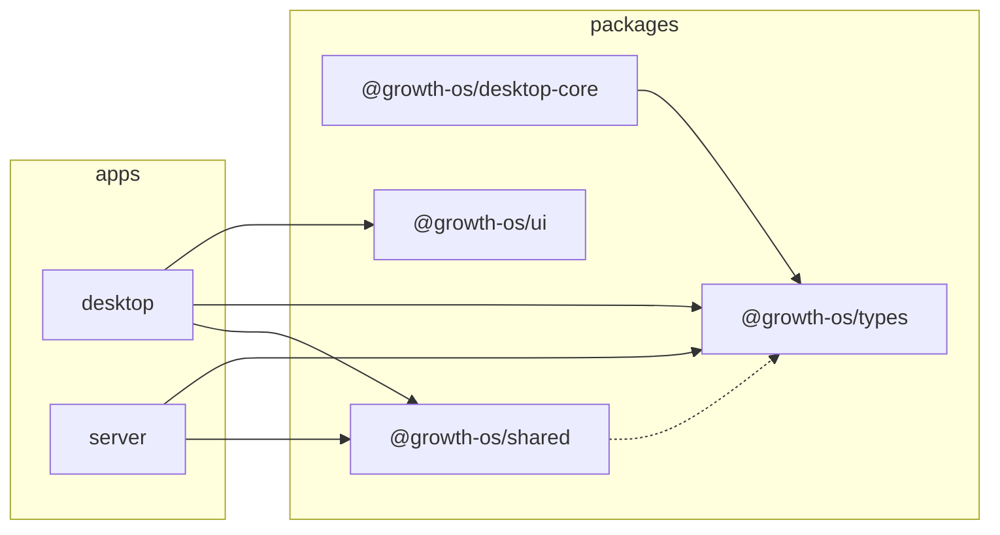

# Module graph

> **Generated** by [generate-module-graph.cjs](../scripts/generate-module-graph.cjs) — do not edit by hand.
> `pnpm verify:docs` fails when this file is stale; regenerate with `pnpm generate:graph` and commit.
> External (non-workspace) dependencies are not listed; the dependency rules that always hold live in [packages/README.md](../packages/README.md).

## apps

| Package | Workspace dependencies | Workspace devDependencies |
| --- | --- |
| `desktop` | `@growth-os/shared`, `@growth-os/types`, `@growth-os/ui` | — |
| `server` | `@growth-os/shared`, `@growth-os/types` | — |

## packages

| Package | Workspace dependencies | Workspace devDependencies |
| --- | --- |
| `@growth-os/desktop-core` | `@growth-os/types` | — |
| `@growth-os/shared` | — | `@growth-os/types` |
| `@growth-os/types` | — | — |
| `@growth-os/ui` | — | — |

## Dependency diagram

Solid arrow: runtime dependency; dashed arrow: devDependency.

